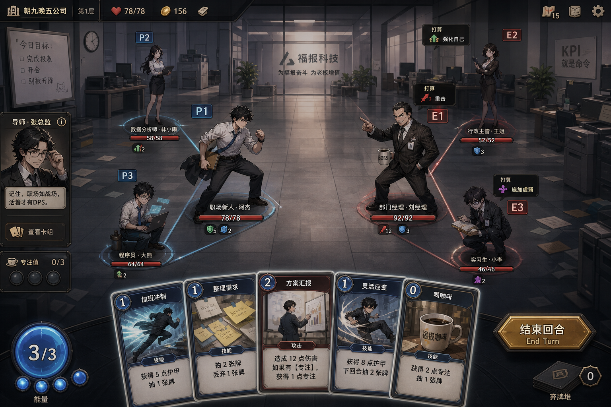
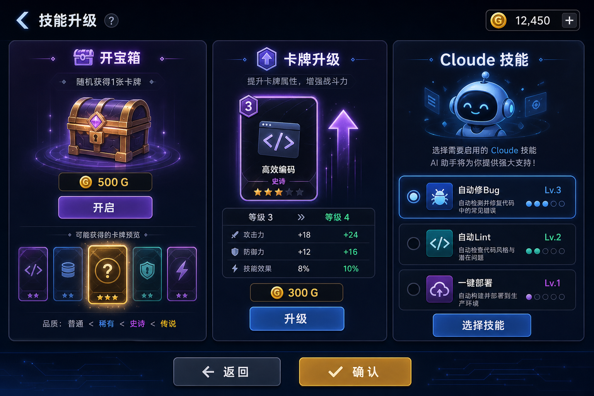

# YES Cloude — 核心 UI 设计说明

> 本文仅描述三张示例图对应的界面规范，不含其他系统展开。

---

## 图1 · Meta 对话（玩家）


| 区域 | 说明 |
|------|------|
| 背景 | 全屏场景图（如办公室），随剧本 `bg` 切换 |
| 立绘 | 说话角色 Meta **正面**立绘，居左或居中偏左；非说话时可隐藏或 dim |
| 对话框 | 底部固定条：说话人名 + 正文；左键继续 |
| 顶栏 | 章节/场景名（可选） |

**规则**：Meta 只用正面立绘 + 背景，不出现战斗站位与手牌。

---

## 图2 · 卡牌战斗（关键）



### 站位（1~3 人 / 1~3 敌，透视一致）

**己方（画面左侧）**

| 槽位 | 位置 | 说明 |
|------|------|------|
| **1 号** | 左侧区域的 **最右、垂直中间**（最靠近中线） | 前排 / 主位，精灵最大 |
| **2 号** | **左上** | 后排，略小 |
| **3 号** | **左下** | 后排，略小 |

**敌方（画面右侧，左右镜像）**

| 槽位 | 位置 | 说明 |
|------|------|------|
| **1 号** | 右侧区域的 **最左、垂直中间**（最靠近中线） | 与己方 1 号对峙 |
| **2 号** | **右上** | 与己方 2 号对称 |
| **3 号** | **右下** | 与己方 3 号对称 |

```
        [2]                    [2]
              [1]    |    [1]
        [3]                    [3]
      ── 己方 ──  中线  ── 敌方 ──
```

- 仅 1 人/1 敌时：只占用 **1 号位**（靠中线）。  
- 2 个单位：占用 **1 号 + 2 号**（或 1+3，由配置指定）。  
- 3 个单位：三角站位全满。  
- 角色用 **战斗序列帧**（idle / attack），不用 Meta 正面立绘。

### 战斗 HUD

| 区域 | 内容 |
|------|------|
| 底部 | 手牌（扇形）、能量、结束回合 |
| 敌人上方 | Intent 意图 |
| 左侧边 | 导师等场外 NPC 小窗（可选，播 talk 序列帧） |

---

## 图3 · 技能升级界面



三栏并列，Meta 事件或战斗间隙进入。

| 栏位 | 功能 | 交互 |
|------|------|------|
| **左 · 开宝箱** | 消耗货币随机获得卡牌 | 显示单价 → 点击开启 → 展示新卡 → 入牌库 |
| **中 · 卡牌升级** | 消耗货币升级已有卡牌 | 选一张已拥有卡 → 预览数值变化 → 确认升级 |
| **右 · Cloude 技能** | 选择 / 切换 Cloude 被动技能 | 列表多选一（或有限多选）；选中后战斗出牌时挂钩 |

**顶栏**：当前货币数量。  
**底栏**：确认离开 / 返回。

**数据**：开箱结果、升级等级、已选 Cloude 技能均写入存档，战斗读同一套数据。

---

## 三图关系

```
Meta 对话（图1）─ 选项/事件 ─→ 技能升级（图3）─ 确认 ─→ 卡牌战斗（图2）
                                    ↑                      │
                                    └──── 战后奖励 ────────┘
```

---

## 资源路径建议

| 图 | 资源 |
|----|------|
| 图1 | `Portraits/Meta/` 背景 `Background/` |
| 图2 | `Sprites/Player/`、`Sprites/Enemy_*/` 按槽位挂到 BattleSlot_1~3 |
| 图3 | UI Prefab + 卡牌/Skill/LootBox 配置表 |
