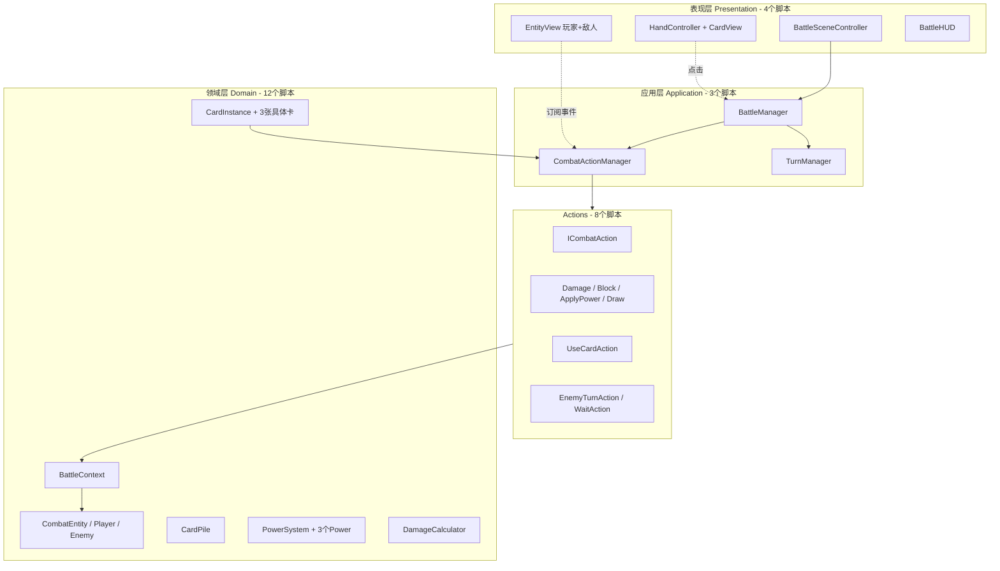
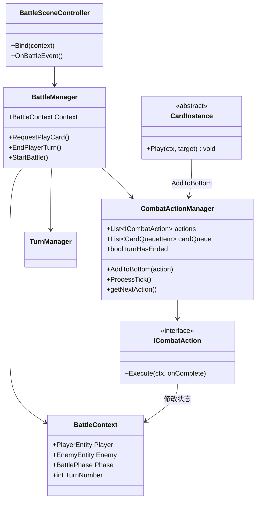
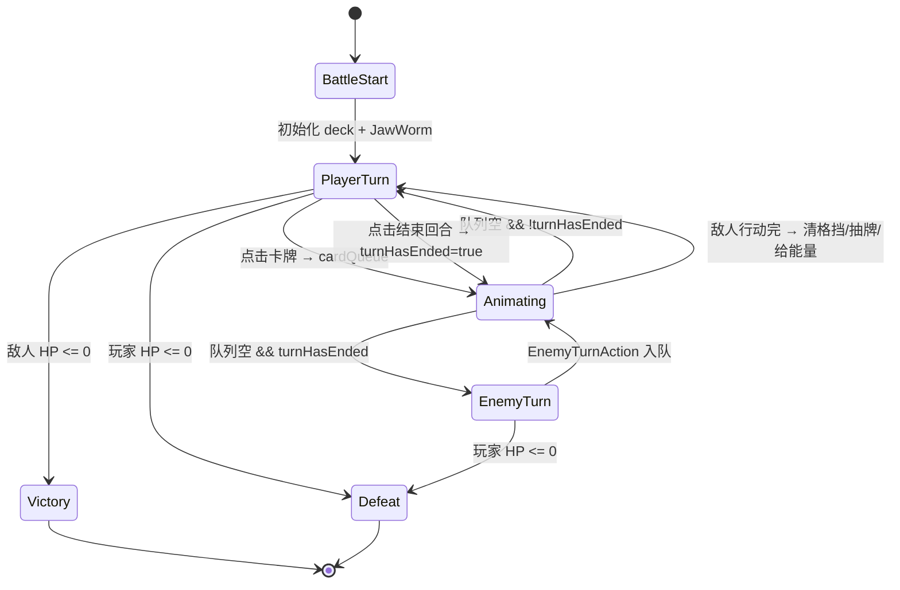

# 《杀戮尖塔》战斗原型 — Unity 2D 设计文档

> **版本**：v2.0（对照原版 Java 代码修订）  
> **范围**：仅战斗原型（单场景、1 名玩家 vs 1 敌人）  
> **表现**：2D 场景（角色在场景中，手牌用 UGUI HUD）  
> **工期**：2 周 MVP  
> **参考代码**：`E:\Demo\MySlayTheSpire`  
> **Unity 项目**：`D:\unity_project\Cloude\Cloude`

---

## 目录

1. [架构选型](#1-架构选型)
2. [用 MVC 理解本架构](#2-用-mvc-理解本架构)
3. [架构总览](#3-架构总览)
4. [与原版 Java 的关键差异修正](#4-与原版-java-的关键差异修正)
5. [Unity 项目结构](#5-unity-项目结构)
6. [代码文件清单（2 周 MVP，约 28 个）](#6-代码文件清单2-周-mvp约-28-个)
7. [关键类关系](#7-关键类关系)
8. [战斗状态机](#8-战斗状态机)
9. [CombatActionManager 核心逻辑](#9-combatactionmanager-核心逻辑)
10. [MVP 功能范围](#10-mvp-功能范围)
11. [JawWorm 敌人设计](#11-jawworm-敌人设计)
12. [与 Java 原版映射表](#12-与-java-原版映射表)
13. [技术选型](#13-技术选型)
14. [2 周开发排期](#14-2-周开发排期)
15. [MVP 验收清单](#15-mvp-验收清单)
16. [预留扩展点](#16-预留扩展点)
17. [总结](#17-总结)

---

## 1. 架构选型

### 1.1 推荐架构：分层架构 + Action 队列 + 数据驱动

**不推荐**直接照搬 Java 的「全局单例 + 胖实体」，也**不推荐**完整 ECS（原型阶段过重）。

| 方案 | 评价 |
|------|------|
| MVC | Unity 里 View 与 MonoBehaviour 天然绑定，硬拆 MVC 反而别扭；但可作为理解框架的类比 |
| 纯 ECS | 学习/搭建成本高，卡牌钩子链不适合纯数据组件 |
| 照搬 Java 单例 | `AbstractDungeon` 式全局状态难测、难扩展 |
| **分层 + Action 队列 + 数据驱动** | 与原版战斗逻辑最接近，又符合 Unity 习惯 |

### 1.2 核心设计原则

1. **数据与表现分离**：战斗逻辑在纯 C# 类里，2D 场景只负责展示。
2. **BattleContext 代替全局单例**：一场战斗的所有状态放在一个上下文对象里。
3. **Action 队列驱动时序**：伤害、格挡、施加 Debuff 逐条执行，方便接动画和 VFX。
4. **出牌两阶段**：`card.use()` 入队效果 Action，再由 `UseCardAction` 收尾（进弃牌堆、扣能量）。
5. **伤害双阶段计算**：Preview（卡面/Intent 显示）与 Resolve（实际结算）共用 Power 逻辑。
6. **Power 钩子保留**：Strength / Weak / Vulnerable 通过子类覆写伤害修正方法。

### 1.3 2 周 MVP 裁剪原则

| 保留（精髓） | 砍掉（外围） |
|-------------|-------------|
| Action 队列 + cardQueue | `ICardEffect` SO 组合配卡 |
| `UseCardAction` 出牌收尾 | `EnemyAIConfig` / `WeightedMoveAI` |
| 双阶段伤害计算 | 独立 `BattleEventBus` 模块 |
| JawWorm 条件 AI 硬编码 | `EntityStats` / `IntentResolver` / `CardFactory` |
| 3 张卡写子类（像原版 Bash.java） | 10 个 Presentation 脚本 |
| 4 个表现层脚本 | Relic / Orb / Stance / 多敌人 |

**目标脚本数：约 28 个**（原方案 63 个，2 周内不可行）

---

## 2. 用 MVC 理解本架构

如果熟悉 MVC，可以把本项目理解为 **「加强版 MVC + 排队办事系统」**：

| MVC 概念 | 本项目对应 |
|----------|-----------|
| **Model（数据/规则）** | `BattleContext`、`PlayerEntity`、`EnemyEntity`、`DamageCalculator`、牌堆 |
| **View（显示）** | `EntityView`、`HandController`、`BattleHUD` |
| **Controller（接输入）** | `BattleSceneController`、`BattleManager` |

**MVC 里没有、但本项目多出来的核心：**

| 额外模块 | 作用 |
|---------|------|
| **Action 队列** | 出牌、伤害、弃牌等操作排队逐条执行，不瞬间全部算完 |

### 2.1 五句话记住架构

1. **View 只显示，不算伤害。**
2. **Controller 只接点击，不直接改 HP。**
3. **Model 存真实战斗状态（血量、牌堆、Buff）。**
4. **Action 队列按顺序办事（伤害、弃牌、等动画）。**
5. **一切玩家操作先进队列，再慢慢改 Model，最后 View 跟着刷新。**

### 2.2 与经典 MVC 的 3 个区别

**区别 1：Controller 不直接改 Model**

```csharp
// ❌ 典型 MVC（本项目不这么做）
void OnStrikeClicked() {
    enemy.hp -= 6;
    player.energy -= 1;
    UpdateUI();
}

// ✅ 本项目
void OnStrikeClicked() {
    battleManager.RequestPlayCard(strike, enemy);  // 只提交请求
    // 后面由 Action 队列慢慢改 Model
}
```

**区别 2：Model 与 View 通过事件通信**

```
Action 改完 Model → 发出事件（OnHpChanged、OnHandChanged）→ View 订阅并刷新
```

**区别 3：回合切换也走队列**

```
点「结束回合」→ 等当前 Action 做完 → 弃手牌 → 敌人行动 → 清格挡/抽牌/给能量 → 回到玩家回合
```

### 2.3 完整流程示例：打出 Strike

```
【View】玩家点击手牌 Strike，再点敌人

【Controller】BattleManager 校验：玩家回合？能量≥1？有目标？
  → OK → 把「打出 Strike」放进 cardQueue

【Action 队列】
  1. 从 cardQueue 取出 Strike
  2. Strike.Play() → 往队列加 DamageAction(6)
  3. 往队列加 UseCardAction（收尾）
  4. 执行 DamageAction → 调 Model 算伤害、扣敌人 HP
  5. 执行 UseCardAction → 扣 1 能量、Strike 进弃牌堆
  6. 队列空 → 回到玩家回合

【View】订阅事件 → 更新血条、手牌、能量显示
```

---

## 3. 架构总览

### 3.1 分层架构图



### 3.2 战斗一帧内的数据流

```
玩家点击卡牌
  → BattleManager.RequestPlayCard()
  → 校验能量/目标/阶段
  → CombatActionManager.cardQueue 入队
  → getNextAction() 处理 cardQueue
  → CardInstance.Play() 内部 AddToBottom(DamageAction...)
  → AddToBottom(UseCardAction)
  → 队列逐条 Execute()
  → 修改 BattleContext 内实体状态
  → 发出事件 (OnHpChanged, OnHandChanged...)
  → Presentation 层订阅事件，刷新 UI
  → 队列空 → TurnManager 判断是否切换回合
```

### 3.3 2D 场景布局

```
BattleScene
├── Background
├── Entities
│   ├── PlayerView        # 世界空间 2D Sprite
│   └── EnemyView
├── UI (Canvas - Screen Space)
│   ├── HandController    # 底部手牌区（UGUI）
│   └── BattleHUD         # 能量、结束回合、回合数
└── VFX（可选）
```

**表现层选型：**

| 元素 | 方案 | 理由 |
|------|------|------|
| 玩家/敌人 | 世界空间 2D Sprite | 符合「实体在场景中」 |
| Intent / HP 条 | 世界空间或 Sub-Canvas | 跟随实体 |
| 手牌 | Screen Space UGUI 底部 | 拖拽/布局成熟，省 2~3 天 |
| 能量/结束回合 | UGUI HUD | 固定位置 |

---

## 4. 与原版 Java 的关键差异修正

对照 `E:\Demo\MySlayTheSpire` 源码，原设计文档有以下 5 处必须修正：

### 4.1 卡牌不是「返回 Action 列表」

原版 `Bash.use()` 同步往队列 `addToBot`，不返回列表：

```java
// Bash.java
public void use(AbstractPlayer p, AbstractMonster m) {
    addToBot(new DamageAction(m, new DamageInfo(p, this.damage, ...)));
    addToBot(new ApplyPowerAction(m, p, new VulnerablePower(m, this.magicNumber, false), ...));
}
```

**修订**：`CardInstance.Play(ctx, target)` 返回 `void`，内部调用 `CombatActionManager.AddToBottom(...)`。

### 4.2 不是单一队列，至少要有 cardQueue

原版 `GameActionManager` 维护多路调度：

```java
public ArrayList<AbstractGameAction> actions = new ArrayList<>();
public ArrayList<AbstractGameAction> preTurnActions = new ArrayList<>();
public ArrayList<CardQueueItem> cardQueue = new ArrayList<>();
public ArrayList<MonsterQueueItem> monsterQueue = new ArrayList<>();
```

**2 周 MVP 至少保留：**
- `actions` — 主 Action 队列
- `cardQueue` — 玩家点击卡牌先入队，排空后再 `use()`
- `turnHasEnded` — 结束回合标志

单敌人原型可将 `EnemyTurnAction` 直接入 `actions`，无需 `monsterQueue`。

### 4.3 出牌两阶段，必须有 UseCardAction

```
点击卡牌 → cardQueue 入队
→ canUse() 校验
→ card.Play() → 效果 Action 入 actions 队
→ UseCardAction（扣能量、移出手牌、进弃牌堆）
```

**不要把「扣能量 / 移出手牌 / 进弃牌堆」写在 BattleManager 里一次性做完。**

### 4.4 伤害有 Preview 和 Resolve 两套链

原版 `DamageInfo.applyPowers()` 四轮修正：

```
atDamageGive → atDamageReceive → atDamageFinalGive → atDamageFinalReceive
```

- **Preview**：卡面数字、Intent 显示
- **Resolve**：`DamageAction` 内实际扣血

两套必须共用 Power 遍历逻辑，否则 Bash + 易伤数值会对不上。

**修订**：`DamageCalculator` 拆为：
- `PreviewDamage(base, attacker, target)`
- `ResolveDamage(base, attacker, target)`

原型可合并 Final 轮，但 Preview 与 Resolve 必须共用核心逻辑。

### 4.5 JawWorm 不是简单权重 AI

原版 `getMove(int num)` 是条件分支 + 历史招式记忆，不是等权重三选一。详见 [第 11 节](#11-jawworm-敌人设计)。

---

## 5. Unity 项目结构

```
Cloude/
├── Docs/
│   └── 杀戮尖塔战斗原型设计文档.md      # 本文档
│
├── Assets/
│   ├── Scenes/
│   │   └── BattlePrototype.unity        # 唯一战斗场景
│   │
│   ├── Prefabs/
│   │   ├── PlayerView.prefab
│   │   ├── EnemyView.prefab
│   │   └── CardView.prefab
│   │
│   ├── Art/                             # 占位色块即可
│   │   ├── Characters/
│   │   ├── Cards/
│   │   └── VFX/
│   │
│   └── Scripts/
│       ├── Core/                        # 3 个文件
│       ├── Data/                        # 4 个文件
│       ├── Battle/                      # 4 个文件
│       ├── Entities/                    # 5 个文件
│       ├── Cards/                       # 4 个文件
│       ├── Powers/                      # 4 个文件
│       ├── Actions/                     # 8 个文件
│       ├── AI/                          # 1 个文件
│       └── Presentation/               # 4 个文件
│
├── Packages/
└── ProjectSettings/
```

---

## 6. 代码文件清单（2 周 MVP，约 28 个）

### 6.1 Core — 基础设施（3 个）

| 文件 | MVC 角色 | 作用 |
|------|---------|------|
| `Core/IBattleEntity.cs` | Model 接口 | 实体接口：EntityId、CurrentHp、CurrentBlock、Powers |
| `Core/EntityId.cs` | Model | 实体唯一标识 |
| `Core/BattlePhase.cs` | Model | 枚举：PlayerTurn / EnemyTurn / Animating / BattleEnd |

> 原方案中的 `GameEvents.cs`、`GameBootstrap.cs` 删除，事件放 `CombatActionManager`，启动放 `BattleSceneController`。

### 6.2 Data — 数据定义（4 个）

| 文件 | 作用 |
|------|------|
| `Data/CardType.cs` | 枚举：Attack / Skill |
| `Data/CardTargetType.cs` | 枚举：Enemy / Self |
| `Data/DamageType.cs` | 枚举：Normal / HpLoss |
| `Data/IntentType.cs` | 枚举：Attack / Defend / Buff / AttackDefend |

> 原方案中的 `CardDefinition SO`、`EnemyDefinition SO`、`EnemyAIConfig SO`、`EnemyMoveDefinition` 在 MVP 阶段删除，数值直接写在 Card/Enemy 子类里。第二版再引入 ScriptableObject。

### 6.3 Battle — 战斗核心（4 个）

| 文件 | MVC 角色 | 作用 |
|------|---------|------|
| `Battle/BattleContext.cs` | Model | 单场战斗状态容器：玩家、敌人、回合计数、当前阶段 |
| `Battle/BattleManager.cs` | Controller | 战斗总控：初始化、接收出牌请求、结束回合 |
| `Battle/CombatActionManager.cs` | Controller + 队列 | actions + cardQueue + getNextAction()，对应 Java `GameActionManager` |
| `Battle/TurnManager.cs` | Controller | 回合逻辑：给能量、抽牌、结束回合、清格挡 |
| `Battle/DamageCalculator.cs` | Model | Preview + Resolve 伤害计算 |

> 原方案中的 `CardPlayService`（合并进 BattleManager）、`BattleSetup`（合并进 BattleSceneController）删除。

### 6.4 Entities — 战斗实体（5 个）

| 文件 | 作用 |
|------|------|
| `Entities/CombatEntity.cs` | 抽象基类：HP、MaxHp、Block、Powers、TakeDamage()、GainBlock() |
| `Entities/PlayerEntity.cs` | 玩家：能量、手牌/抽牌堆/弃牌堆（CardPile） |
| `Entities/EnemyEntity.cs` | 敌人：当前 Intent、下一招 Move |
| `Entities/CardPile.cs` | 牌堆容器：抽牌、洗牌、弃牌 |
| `Entities/IntentData.cs` | 敌人意图展示数据：类型 + 预计数值 |

### 6.5 Cards — 卡牌系统（4 个）

| 文件 | 作用 |
|------|------|
| `Cards/CardInstance.cs` | 运行时卡牌基类：`abstract void Play(ctx, target)` |
| `Cards/StrikeCard.cs` | 打击：6 伤害 |
| `Cards/DefendCard.cs` | 防御：5 格挡 |
| `Cards/BashCard.cs` | 痛击：8 伤害 + 施加 2 层 Vulnerable |

> 原方案中的 `ICardEffect`、`CardFactory`、4 个 Effect 类在 MVP 阶段删除。第二版再引入 Effect 组合或 ScriptableObject 配卡。

**原型卡组（10 张）：**

| 卡 | 数量 | 效果 |
|----|------|------|
| Strike | ×5 | 6 伤害 |
| Defend | ×4 | 5 格挡 |
| Bash | ×1 | 8 伤害 + 2 层易伤 |

### 6.6 Powers — Buff/Debuff（4 个）

| 文件 | 作用 |
|------|------|
| `Powers/PowerInstance.cs` | 运行时 Power：层数、持有者、是否回合衰减 |
| `Powers/PowerSystem.cs` | 施加/合并/移除 Power；回合末衰减 |
| `Powers/StrengthPower.cs` | 力量：atDamageGive +amount |
| `Powers/WeakPower.cs` | 虚弱：atDamageGive ×0.75（攻击方） |
| `Powers/VulnerablePower.cs` | 易伤：atDamageReceive ×1.5（受击方） |

> 删除统一 `IPowerHook` 接口，各 Power 子类直接覆写需要的方法（对齐原版 `AbstractPower` 空实现模式）。

### 6.7 Actions — 命令队列（8 个）

| 文件 | 对应 Java | 作用 |
|------|----------|------|
| `Actions/ICombatAction.cs` | `AbstractGameAction` | 接口：Execute(ctx, onComplete) |
| `Actions/ActionBase.cs` | — | 基类：统一日志、完成回调 |
| `Actions/DamageAction.cs` | `DamageAction` | 对目标造成伤害 |
| `Actions/GainBlockAction.cs` | `GainBlockAction` | 获得格挡 |
| `Actions/ApplyPowerAction.cs` | `ApplyPowerAction` | 施加 Power |
| `Actions/DrawCardAction.cs` | `DrawCardAction` | 抽 N 张牌 |
| `Actions/UseCardAction.cs` | `UseCardAction` | **出牌收尾：扣能量、移出手牌、进弃牌堆** |
| `Actions/DiscardHandAction.cs` | — | 回合结束弃手牌 |
| `Actions/EnemyTurnAction.cs` | — | 驱动敌人 takeTurn |
| `Actions/WaitAction.cs` | `WaitAction` | 等待（给动画留时间） |

**与 Java 的对应关系：**

```
Java Card.use()           → CardInstance.Play() 内部 AddToBottom
Java addToBot(action)     → CombatActionManager.AddToBottom()
Java action.update()      → ICombatAction.Execute()
Java UseCardAction        → UseCardAction（出牌收尾，不负责 use()）
Java cardQueue            → CombatActionManager.cardQueue
```

### 6.8 AI — 敌人 AI（1 个）

| 文件 | 作用 |
|------|------|
| `AI/JawWormAI.cs` | 移植原版 getMove() 条件分支 + moveHistory |

> 原方案中的 `IEnemyAI`、`WeightedMoveAI`、`IntentResolver` 删除。

### 6.9 Presentation — 2D 场景表现（4 个）

| 文件 | MVC 角色 | 作用 |
|------|---------|------|
| `Presentation/BattleSceneController.cs` | Controller 入口 | 场景总控：初始化 BattleManager、绑定 View、驱动 Update |
| `Presentation/EntityView.cs` | View | 玩家/敌人共用：HP 条、格挡、Intent、受击反馈 |
| `Presentation/HandController.cs` | View | 手牌区布局、点击出牌（内含 CardView 逻辑） |
| `Presentation/BattleHUD.cs` | View | 能量、结束回合按钮、回合数、胜负界面 |

> 原方案 10 个 Presentation 脚本合并为 4 个。`TargetSelector`、`CombatVFXPlayer`、`CameraShake` 延后到 Phase 7。

### 6.10 文件数量汇总

| 模块 | MVP 文件数 | 原方案 |
|------|-----------|--------|
| Core | 3 | 5 |
| Data | 4 | 8 |
| Battle | 4 | 7 |
| Entities | 5 | 6 |
| Cards | 4 | 7 |
| Powers | 4 | 5 |
| Actions | 8 | 10 |
| AI | 1 | 3 |
| Presentation | 4 | 10 |
| **合计** | **约 28** | **约 63** |

---

## 7. 关键类关系



---

## 8. 战斗状态机



**原型简化规则：**

- `Animating` 阶段（`CombatActionManager.IsBusy == true`）**禁止**出牌和结束回合
- 原版允许动画中继续往 cardQueue 排队，原型不做
- `EnemyTurn` 不是独立长状态，而是 `turnHasEnded` 后队列处理完自动触发

---

## 9. CombatActionManager 核心逻辑

### 9.1 getNextAction() 伪代码

```csharp
void ProcessTick() {
    // 1. 如果当前有 Action 在执行，继续 Tick
    if (currentAction != null) {
        currentAction.Tick();
        if (!currentAction.IsDone) return;
        currentAction = null;
    }

    // 2. 主 Action 队列
    if (actions.Count > 0) {
        currentAction = actions.Dequeue();
        return;
    }

    // 3. 出牌队列（对应 Java cardQueue 处理）
    if (cardQueue.Count > 0) {
        var item = cardQueue.Dequeue();
        if (!CanUse(item)) return;
        item.Card.Play(ctx, item.Target);       // 内部 AddToBottom 效果 Action
        AddToBottom(new UseCardAction(item.Card)); // 收尾
        return;
    }

    // 4. 敌人回合（玩家已点结束回合）
    if (turnHasEnded && !enemyTurnStarted) {
        enemyTurnStarted = true;
        AddToBottom(new EnemyTurnAction(enemy));
        return;
    }

    // 5. 新回合初始化
    if (turnHasEnded && enemyTurnDone) {
        turnManager.StartNewPlayerTurn();
        turnHasEnded = false;
        enemyTurnStarted = false;
        enemyTurnDone = false;
    }
}
```

### 9.2 原版 getNextAction 优先级（参考）

```
actions → preTurnActions → cardQueue → monsterQueue → 新回合初始化
```

2 周 MVP 简化为：

```
actions → cardQueue → 敌人回合（turnHasEnded）→ 新回合初始化
```

---

## 10. MVP 功能范围

### 10.1 必须实现（P0）

| 系统 | 内容 |
|------|------|
| Action 队列 | actions + cardQueue + WaitAction |
| 出牌流程 | 校验 → Play() 入队 → UseCardAction 收尾 |
| 牌堆 | 抽牌堆 / 手牌 / 弃牌堆 / 洗牌 |
| 能量 & 回合 | 3 能量、结束回合、敌人回合、新回合抽 5 张 |
| 格挡 | 先扣 Block 再扣 HP |
| 伤害链 | Strength +N / Weak ×0.75 / Vulnerable ×1.5 |
| 3 张卡 | Strike(6) / Defend(5) / Bash(8+2易伤) |
| JawWorm | 三招 + Intent + 条件 AI |
| 最小 UI | 能量、HP/格挡、Intent、结束回合、手牌可点 |

### 10.2 有余力再做（P1）

| 系统 | 内容 |
|------|------|
| 胜负 | 敌人死亡 / 玩家 HP ≤ 0 界面 |
| 简单反馈 | 伤害飘字、受击闪白 |

### 10.3 故意不做（后续扩展）

- 地图、商店、篝火、事件
- 遗物系统（接口预留 `IRelicHook`）
- 卡牌升级、消耗、保留、X 费卡
- 多角色、球、姿态
- 多敌人、存档
- `atEndOfRound` 的 `justApplied` 跳过逻辑（简化为整轮结束 Power -1）
- 单元测试框架

---

## 11. JawWorm 敌人设计

> 源码：`E:\Demo\MySlayTheSpire\src\main\java\com\megacrit\cardcrawl\monsters\exordium\JawWorm.java`

### 11.1 基础数值

| 属性 | 值 |
|------|-----|
| HP | 40~44（随机） |
| 首回合 | 固定 Chomp |

### 11.2 三招

| Move | Intent | 效果 |
|------|--------|------|
| 1 CHOMP | ATTACK | 11 伤害 |
| 2 BELLOW | DEFEND_BUFF | +3 Strength，+6 Block |
| 3 THRASH | ATTACK_DEFEND | 7 伤害 + 5 Block |

### 11.3 getMove(int num) 逻辑

`num = Random(0, 99)`

```
1. 首回合（firstMove）→ 固定 Chomp，return

2. num < 25：
   - 若上一招是 Chomp → 56.25% Bellow / 43.75% Thrash
   - 否则 → Chomp

3. 25 ≤ num < 55：
   - 若连续两招 Thrash → 35.7% Chomp / 64.3% Bellow
   - 否则 → Thrash

4. num ≥ 55：
   - 若上一招 Bellow → 41.6% Chomp / 58.4% Thrash
   - 否则 → Bellow
```

### 11.4 takeTurn() 执行顺序

```
按 nextMove 执行招式 Action（伤害/加力量/加格挡）
→ 末尾 RollMoveAction → rollMove() → getMove() → setMove() → 更新 Intent
```

### 11.5 原型实现要点

- 复制 `getMove` 分支 + `moveHistory` + 首回合 Chomp
- **不要用**等权重三选一
- Intent 显示必须与 `setMove` 后的下一招一致

---

## 12. 与 Java 原版映射表

| Java 原版 | Unity MVP |
|-----------|-----------|
| `AbstractDungeon` | `BattleContext` + `BattleManager` |
| `GameActionManager` | `CombatActionManager` |
| `AbstractCard.use()` | `CardInstance.Play()` + 内部入队 |
| `CardGroup` | `CardPile` |
| `AbstractCreature` | `CombatEntity` |
| `AbstractPlayer` | `PlayerEntity` + `EntityView` |
| `AbstractMonster.takeTurn()` | `EnemyEntity` + `EnemyTurnAction` |
| `AbstractPower` 钩子 | 各 Power 子类覆写方法 |
| `DamageInfo.applyPowers()` | `DamageCalculator.Preview/Resolve` |
| `AbstractCard.render()` | `HandController` + `CardView` |
| `AbstractRoom.update()` | `BattleSceneController.Update()` 驱动 `ProcessTick()` |
| `UseCardAction` | `UseCardAction` |
| `CardQueueItem` | `CardQueueItem`（cardQueue 元素） |

---

## 13. 技术选型

| 项 | 建议 |
|----|------|
| Unity 版本 | 2022.3 LTS 或更高（当前项目已配置 MCP 插件） |
| 渲染 | 2D Sprite + Sorting Layer |
| UI | 手牌/HUD 用 UGUI；实体用世界空间 Sprite |
| 动画 | 原型用 Coroutine / 简单 Tween，不必强依赖 DOTween |
| 输入 | 鼠标点击选手牌 + 点敌人；后续可加 New Input System |
| 异步 | Action 完成用 `Action onComplete` 回调 |
| 测试 | MVP 手动打局验证；第二版再加 Unity Test Framework |

---

## 14. 2 周开发排期

| 天 | Phase | 任务 | 产出 | 验收标准 |
|----|-------|------|------|----------|
| D1-2 | Phase 1 骨架 | BattleContext, CombatEntity, CardPile, PlayerEntity | 纯逻辑层可实例化 | 能创建玩家+牌堆并抽牌 |
| D3-4 | Phase 2 队列 | CombatActionManager, DamageAction, GainBlockAction, WaitAction | Action 队列跑通 | 控制台 Strike 打敌人扣血 |
| D5-6 | Phase 3 出牌 | cardQueue, UseCardAction, StrikeCard, DefendCard, 能量/抽牌 | 完整出牌流程 | 能量消耗、手牌增减正确 |
| D7-8 | Phase 4 Power | Strength/Weak/Vulnerable, DamageCalculator 双阶段 | 伤害链正确 | Bash+易伤后 Strike 伤害正确 |
| D9-10 | Phase 5 敌人 | JawWormAI, EnemyTurnAction, BashCard, Intent | 敌人回合完整 | JawWorm 三招循环，Intent 准确 |
| D11-12 | Phase 6 表现 | BattleSceneController, EntityView, HandController, BattleHUD | 可视化可玩 | 能点击出牌、结束回合 |
| D13-14 | Phase 7 打磨 | 飘字、胜负界面、流程 bug 修复 | 完整原型 | 能完整打完一局 |

### 14.1 开发顺序图

```
Phase 1  骨架
  BattleContext, CombatEntity, CardPile, BattlePhase

Phase 2  Action 队列
  ICombatAction, CombatActionManager, DamageAction, GainBlockAction

Phase 3  回合与出牌
  TurnManager, cardQueue, UseCardAction, StrikeCard, DefendCard

Phase 4  Power
  PowerSystem, Strength/Weak/Vulnerable, DamageCalculator

Phase 5  敌人
  JawWormAI, Intent, EnemyTurnAction, BashCard

Phase 6  2D 表现
  BattleSceneController, EntityView, HandController, BattleHUD

Phase 7  打磨
  飘字、受击、结束回合流程、胜负界面
```

---

## 15. MVP 验收清单

- [ ] 10 张牌组（5 Strike / 4 Defend / 1 Bash）可洗牌循环
- [ ] 每回合 3 能量，结束回合后敌人行动
- [ ] 格挡正确消耗，新回合开始清空格挡
- [ ] 力量 +3 伤害 / 虚弱 ×0.75 / 易伤 ×1.5 数值正确
- [ ] Bash 施加易伤后，后续攻击伤害正确增加
- [ ] JawWorm 首回合 Chomp，后续按条件分支出招
- [ ] Intent 显示下一招类型和预计数值
- [ ] 手牌可点击出牌（单目标攻击牌需选敌人）
- [ ] 敌人 HP ≤ 0 胜利，玩家 HP ≤ 0 失败
- [ ] 完整打完一局无阻塞、无状态错乱

---

## 16. 预留扩展点

第二版及以后扩展时，以下接口/结构提前留好位置即可，MVP 不实现：

```csharp
// 遗物钩子 — 空接口
public interface IRelicHook {
    void OnPlayCard(CardInstance card) { }
    int ModifyDamageDealt(int baseDamage) => baseDamage;
}

// 卡牌 ScriptableObject — 第二版引入
// public class CardDefinition : ScriptableObject { ... }

// 通用 Effect 组合 — 第二版引入
// public interface ICardEffect {
//     void CreateActions(BattleContext ctx, CombatEntity source, CombatEntity target);
// }

// 多敌人 — BattleContext.Enemies 保持 List 结构
// public List<EnemyEntity> Enemies { get; }
```

---

## 17. 总结

**最合适架构：**

> 分层架构 + BattleContext 局部状态 + Action 命令队列（含 cardQueue）+ 事件驱动的 2D 表现层

**核心要点：**

1. 用 MVC 理解：View 显示、Controller 接输入、Model 存状态，中间加 Action 队列办事
2. 对照原版 Java：出牌两阶段、双阶段伤害、JawWorm 条件 AI 不可简化
3. 2 周 MVP：28 个脚本、4 个表现层类、3 张卡硬编码、1 个敌人
4. 表现务实：手牌 UGUI 底部，实体世界空间 2D Sprite

这样既保留《杀戮尖塔》战斗「排队结算、Power 钩子」的精髓，又避免 Java 反编译代码里「全局单例 + 逻辑渲染耦合」的问题，后续加卡牌、加 Power、加遗物都有清晰扩展点。

---

*文档维护：开发过程中若架构决策有变，请同步更新本文档对应章节。*
